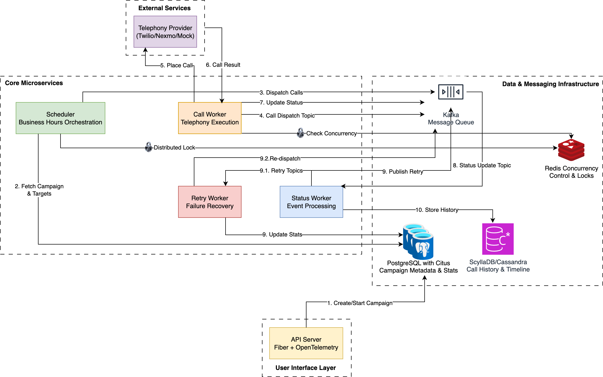

# Outbound Voice Campaign Platform: Architecture Overview

This document provides a detailed overview of the architecture for the Outbound Voice Campaign platform. It covers the core components, their responsibilities, design choices, and how they interact to deliver a scalable and resilient system.

## 1. Core Principles

The architecture is guided by the following principles:

-   **Scalability**: The system is designed to handle a high volume of concurrent outbound calls by leveraging horizontal scaling of its components.
-   **Resilience**: The platform is built to be fault-tolerant, with mechanisms for retrying failed operations and ensuring data consistency.
-   **Modularity**: Each component has a well-defined responsibility, allowing for independent development, deployment, and scaling.
-   **Asynchronous Processing**: Heavy-lifting tasks like placing calls and updating statuses are handled asynchronously to ensure the API remains responsive.
-   **Observability**: The system is designed to be monitored and traced, with structured logging and tracing to provide visibility into its behavior.

## 2. System Architecture Diagram

## 3. Core Components

### 3.1. API Server

-   **Responsibilities**:
    -   Provides a RESTful API for managing campaigns (create, start, pause, view).
    -   Handles user authentication and authorization.
    -   Validates incoming requests and ensures data integrity.
    -   Acts as the primary entry point for all user interactions.

-   **Design Choices**:
    -   Built with **Go** and the **Fiber** web framework for high performance and low memory footprint.
    -   Follows a standard RESTful API design for ease of integration with other services and UIs.
    -   Stateless design allows for horizontal scaling behind a load balancer.

### 3.2. Scheduler

-   **Responsibilities**:
    -   The "brains" of the system, responsible for orchestrating outbound calls.
    -   Periodically queries the database for active campaigns.
    -   Checks for campaigns that are within their configured business hours.
    -   Fetches a batch of pending call targets for each active campaign.
    -   **Prioritizes retries**: Before dispatching new calls, it checks if there are any calls in the retry topics. If so, it skips new call dispatch to allow the Retry Worker to process them first, ensuring fairness and efficiency.
    -   Publishes call dispatch messages to a Kafka topic.

-   **Design Choices**:
    -   Runs as a separate Go microservice to decouple it from the API server.
    -   Uses a distributed lock (via Redis) to ensure that only one instance of the scheduler is active at a time, preventing duplicate call dispatches.
    -   The scheduling logic is designed to be idempotent, meaning that if it runs multiple times, it won't create duplicate calls.

### 3.3. Call Worker

-   **Responsibilities**:
    -   Consumes call dispatch messages from a Kafka topic.
    -   Interacts with the external **Telephony Provider** to place the actual voice call.
    -   Respects the campaign's concurrency limits using a distributed semaphore (via Redis).
    -   Once the call is completed, it publishes a status update message to a Kafka topic.

-   **Design Choices**:
    -   As a separate Go microservice, it can be scaled independently to handle a high volume of concurrent calls.
    -   The use of a message queue (Kafka) decouples it from the scheduler, allowing for a resilient and scalable call dispatch mechanism.
    -   The distributed semaphore ensures that the system does not exceed the concurrency limits set for each campaign.

### 3.4. Status Worker

-   **Responsibilities**:
    -   Consumes call status update messages from a Kafka topic.
    -   Updates the status of the call in the primary database (PostgreSQL).
    -   Records the call attempt and its outcome in the historical database (ScyllaDB/Cassandra).
    -   Updates the campaign's statistics (e.g., completed, failed, in-progress calls).
    -   If a call has failed and is retryable, it publishes a message to a retry topic in Kafka.

-   **Design Choices**:
    -   A separate Go microservice that can be scaled to handle a high volume of status updates.
    -   The use of a message queue ensures that status updates are not lost, even if the worker is temporarily unavailable.

### 3.5. Retry Worker

-   **Responsibilities**:
    -   Consumes messages from one or more retry topics in Kafka.
    -   Each retry topic corresponds to a different retry level with an increasing delay.
    -   Re-publishes the call dispatch message back to the main dispatch topic, allowing the Call Worker to retry the call.
    -   Implements an exponential backoff strategy with jitter to avoid overwhelming the system with retries.

-   **Design Choices**:
    -   A separate Go microservice that can be scaled to handle a high volume of retries.
    -   The use of multiple retry topics allows for a simple and effective implementation of the exponential backoff strategy.

## 4. Data & Messaging Infrastructure

### 4.1. PostgreSQL

-   **Role**: Primary data store.
-   **Data Stored**:
    -   Campaign configurations (name, status, retry policy, etc.).
    -   Campaign targets (phone numbers, metadata).
    -   Real-time campaign statistics.
-   **Design Choice**: A reliable, transactional database that is well-suited for structured data and complex queries.

### 4.2. ScyllaDB / Cassandra

-   **Role**: Historical data store (not fully implemented in the current version).
-   **Data Stored**:
    -   Call history and individual call attempts.
-   **Design Choice**: A highly scalable, wide-column NoSQL database that is optimized for write-heavy workloads and time-series data.

### 4.3. Redis

-   **Role**: Caching and coordination.
-   **Functionality**:
    -   **Distributed Locking**: Used by the Scheduler to ensure single-instance execution.
    -   **Concurrency Limiting**: Used by the Call Worker to enforce campaign concurrency limits.
-   **Design Choice**: An in-memory data store that provides fast access to data and is well-suited for implementing distributed primitives.

### 4.4. Kafka

-   **Role**: Asynchronous message bus.
-   **Topics**:
    -   `campaign.calls.dispatch`: For dispatching new calls.
    -   `campaign.calls.status`: For updating call statuses.
    -   `campaign.calls.retry.{n}`: For handling retries with exponential backoff.
    -   `campaign.calls.deadletter`: For storing messages that could not be processed.
-   **Design Choice**: A distributed, fault-tolerant streaming platform that enables a decoupled, asynchronous architecture and can handle a high volume of messages.

## 5. Data Flow

1.  A user creates a new campaign via the **API Server**, which is stored in **PostgreSQL**.
2.  The **Scheduler** queries **PostgreSQL** for active campaigns and their targets.
3.  The **Scheduler** publishes call dispatch messages to the `campaign.calls.dispatch` topic in **Kafka**.
4.  A **Call Worker** consumes a message, places the call via the **Telephony Provider**, and publishes a status update to the `campaign.calls.status` topic.
5.  A **Status Worker** consumes the status message, updates the call and campaign stats in **PostgreSQL**, and if the call failed and is retryable, publishes a message to a `campaign.calls.retry.{n}` topic.
6.  A **Retry Worker** consumes the retry message after a delay and re-publishes it to the `campaign.calls.dispatch` topic.
7.  This cycle continues until the call is successful or has reached its maximum number of retries.

## 6. Scalability & Resilience

-   **Scalability**:
    -   The stateless **API Server** can be horizontally scaled.
    -   The **Call, Status, and Retry Workers** can be scaled independently based on the workload.
    -   **Kafka and ScyllaDB** are inherently distributed and can be scaled by adding more nodes.
-   **Resilience**:
    -   If a worker crashes, **Kafka** retains the messages, and another worker can process them.
    -   The **Scheduler**'s distributed lock prevents duplicate call dispatches.
    -   The **Retry Worker** ensures that failed calls are not lost and are retried.
    -   The **Dead Letter Queue** captures messages that fail repeatedly, allowing for manual inspection and debugging.
